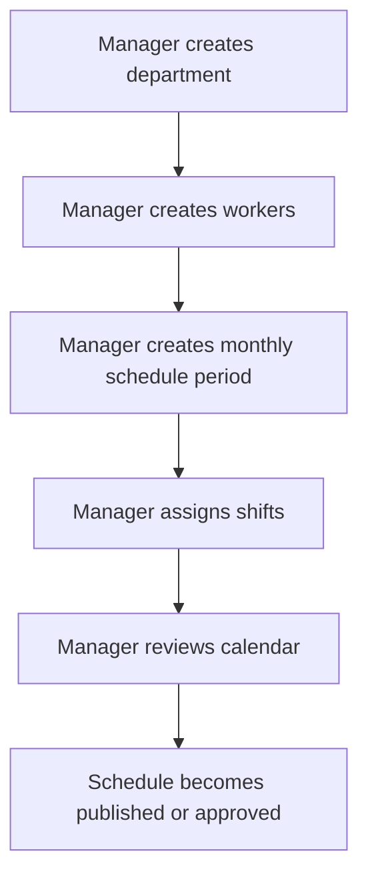
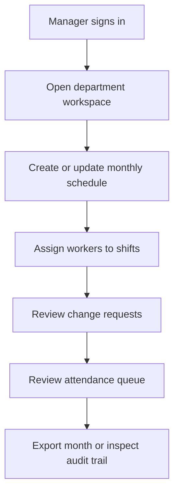
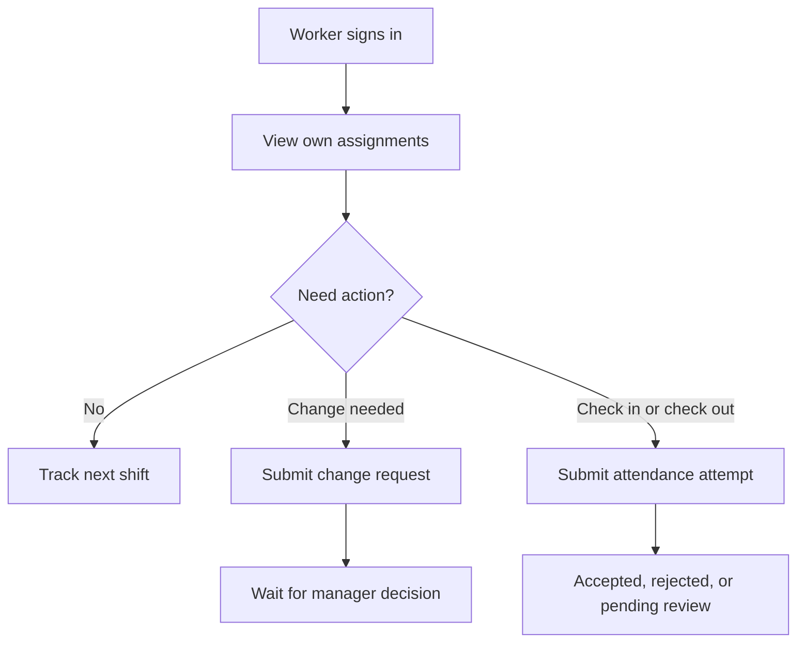
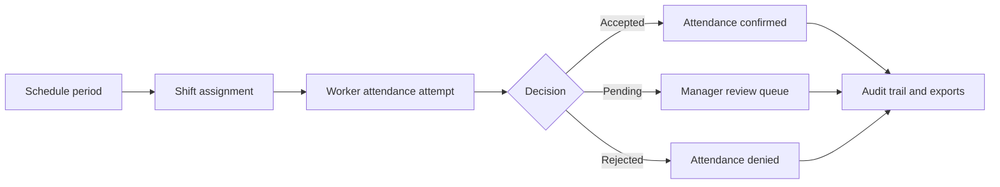
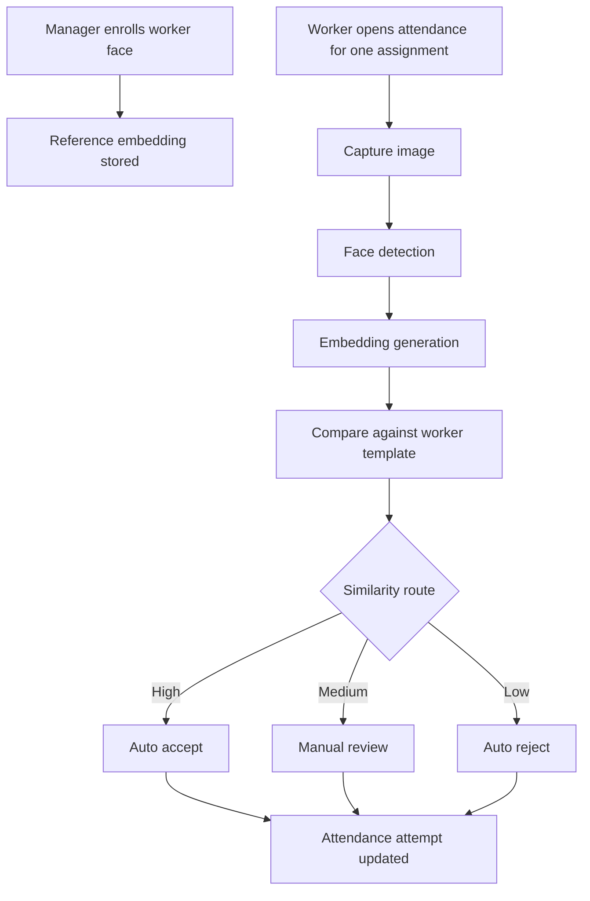
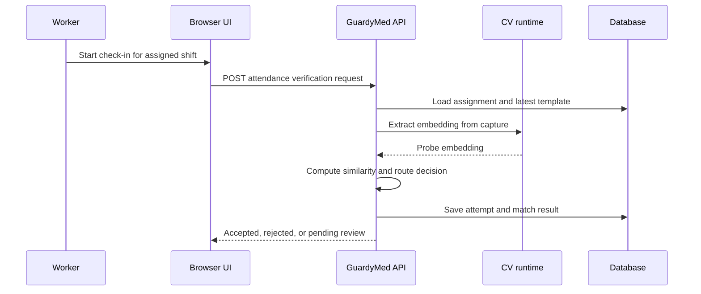

# GuardyMed

Version: `0.1.1`

## Overview

GuardyMed is a healthcare workforce operations MVP focused on monthly shift scheduling, worker self-service flows, approval workflows, attendance scaffolding, auditability, and operational exports.

## Problem Context

Healthcare scheduling is often managed through fragmented tools such as spreadsheets, chat messages, and manual approval flows.

That creates predictable operational problems:

- schedules are harder to validate before use
- shift changes are harder to trace
- approvals are harder to reconstruct
- exports for operations or compliance become manual work

GuardyMed is being designed to reduce that operational fragmentation with a clearer scheduling core and an auditable workflow.

For portfolio purposes, the project is framed as a system-design-heavy healthcare product rather than a startup pitch or a generic admin dashboard.

## Current Scope

The current repository scope is intentionally narrow.

It currently includes:

- a FastAPI backend scaffold
- a Vue + Vite frontend source app under `apps/frontend`
- a production build served by FastAPI under `/app`
- session-based workflows for manager and worker
- scheduling, change request, approval, audit, export, and attendance scaffold endpoints
- a basic browser face-enrollment and face-verification flow for the worker attendance demo
- an initial Phase A system definition and architecture direction

## Solution Direction

GuardyMed currently solves the operational core first:

- build a monthly schedule period
- assign staff to guard shifts
- enroll workers for attendance
- let workers submit manual attendance attempts
- let workers submit change requests
- let managers review queue items
- let managers review attendance attempts
- preserve audit events
- generate monthly exports

The current product story is:

- manager builds the month
- worker reacts to assigned work
- manager reviews and closes the loop

## Architecture

Current implementation is a modular monolith:

- one FastAPI app
- one Vue frontend built into `apps/web` and mounted at `/app`
- one scheduling domain module
- one persistence path through SQLAlchemy

This keeps Phase A simple while preserving clear boundaries for later AI and CV modules.

The next planned AI boundary is face-recognition attendance only. The current MVP does not implement CV yet; it prepares the workflow and data boundaries for that future module.

## Phase Status

This repository should be read as:

- `Phase 1 complete`
- portfolio-grade MVP
- not a finished production product
- ready for demo, walkthrough, and architecture discussion

## C4 Architecture

### C1 — System Context

### C2 — Containers

### C3 — Components

Detailed diagrams and final narrative can be added after the visual C4 exports are prepared.

## User and System Flows

### Scheduling flow



### Manager flow



### Worker flow



### Scheduling and attendance relationship



### Face-recognition attendance flow



### Attendance verification sequence



## Deployment

Local development runs as a single FastAPI process.

- API docs: `/docs`
- mounted app: `/app`
- health check: `/health`
- frontend dev server: `http://127.0.0.1:5173/`

The production-style local build is served from FastAPI under `/app`.

## Demo Accounts

- manager: `manager@guardymed.local`
- worker: `worker@guardymed.local`
- password: `password123`

## Tech Stack

- FastAPI
- SQLAlchemy
- SQLite by default for local development
- Vue 3
- Vite
- PrimeVue
- pytest

## Domain Model

Current core entities:

- Department
- Worker
- SchedulePeriod
- ShiftAssignment
- AttendanceEnrollment
- AttendanceAttempt
- ChangeRequest
- ApprovalDecision
- AuditEvent
- ExportJob

## API Design

Base path: `/api/v1/scheduling`

Auth model for the current MVP:

- session cookie via `/api/v1/auth/login`
- demo bootstrap via `/api/v1/auth/bootstrap-demo`
- mounted UI uses cookie-backed auth

Supported roles:

- `manager`
- `worker`

Implemented endpoints:

- `POST /auth/bootstrap-demo`
- `POST /auth/login`
- `POST /auth/logout`
- `GET /auth/session`
- `GET /capabilities`
- `GET /attendance/capabilities`
- `POST /demo/seed`
- `GET /departments`
- `POST /departments`
- `GET /workers`
- `POST /workers`
- `GET /attendance/enrollments`
- `POST /attendance/enrollments`
- `POST /attendance/cv/enrollments`
- `GET /attendance/attempts`
- `POST /attendance/attempts`
- `POST /attendance/cv/attempts`
- `GET /attendance/cv/attempts/{attempt_id}/match-result`
- `GET /attendance/review-queue`
- `PATCH /attendance/attempts/{attempt_id}`
- `GET /schedule-periods`
- `POST /schedule-periods`
- `GET /schedule-periods/{period_id}`
- `PATCH /schedule-periods/{period_id}`
- `GET /schedule-periods/{period_id}/calendar`
- `POST /schedule-periods/{period_id}/assignments`
- `PATCH /assignments/{assignment_id}`
- `GET /workers/{worker_id}/assignments`
- `GET /change-requests`
- `GET /change-requests/{request_id}`
- `POST /assignments/{assignment_id}/change-requests`
- `PATCH /change-requests/{request_id}`
- `GET /review-queue`
- `POST /approval-decisions`
- `GET /audit-events`
- `POST /schedule-periods/{period_id}/exports`
- `GET /schedule-periods/{period_id}/exports`
- `GET /exports/{export_id}`

## Local Run

Backend:

```bash
uv run uvicorn apps.api.app.main:app --reload --host 127.0.0.1 --port 8000
```

Frontend dev:

```bash
npm run dev -- --host 127.0.0.1 --port 5173
```

Production-style local UI:

- `http://127.0.0.1:8000/app`

## Release Notes — v0.1.1

- stabilized manager and worker demo flows
- improved review queue readability
- simplified audit trail presentation
- reduced raw internal IDs in the UI
- improved attendance enrollment guards
- fixed FastAPI-mounted frontend asset paths under `/app`

Quick local run:

- `uv run uvicorn apps.api.app.main:app --reload`
- `cd apps/frontend && npm run dev` for the Vite dev server
- open `http://127.0.0.1:8000/app`
- load demo data from the session panel or call `POST /api/v1/auth/bootstrap-demo`

## Core Workflows

1. Manager creates a department, workers, a monthly schedule period, and assignments.
2. Manager enrolls a worker for attendance.
3. Worker views only their own assignments, then submits a change request or attendance attempt.
4. Manager reviews schedule items, worker requests, and attendance attempts.
5. Audit events and exports reflect the resulting operational state.

## Face Recognition Decision

The baseline verification method is still embedding comparison plus explicit thresholds.

That is not a toy choice. It is the normal production baseline for face verification because the problem is:

- one known worker
- one attendance attempt
- one or a few enrolled templates
- one similarity score
- one auditable route

For this system, the important distinction is:

- verification: "is this the enrolled face for this worker?" -> embedding similarity is the right default
- identification: "who is this among all workers?" -> needs a broader search strategy and may justify pgvector or a dedicated vector index later

Better than a raw single-threshold flow does not mean replacing embeddings. It means making the verification pipeline stricter:

1. face detection and quality gate first
2. liveness or anti-spoof check
3. multi-frame capture instead of one still image
4. compare against more than one enrollment template
5. use a three-way route instead of binary pass or fail

In practice the upgrade path is:

- phase 1: one embedding comparison, accept and review thresholds
- phase 2: quality checks plus multi-template comparison
- phase 3: liveness and device-camera capture hardening

So the better option is not "something other than embeddings".
The better option is "embeddings plus better gates around them".

## Internal Docs

Useful internal references:

- architecture: [docs/ARCHITECTURE.md](docs/ARCHITECTURE.md)
- face-recognition attendance design: [docs/AI_ARCHITECTURE.md](docs/AI_ARCHITECTURE.md)
- portfolio framing: [docs/PORTFOLIO_DIRECTION.md](docs/PORTFOLIO_DIRECTION.md)
- demo walkthrough: [docs/DEMO_FLOW.md](docs/DEMO_FLOW.md)
- portfolio research: [docs/RESEARCH.md](docs/RESEARCH.md)
- internal decisions: [docs/DECISIONS.md](docs/DECISIONS.md)

## Repository Structure

- `apps/api`: backend API and domain logic
- `apps/frontend`: Vue + Vite source frontend
- `apps/web`: built frontend assets served by FastAPI
- `tests`: backend and route registration tests
- `docs`: product, architecture, and research notes

## Development Workflow

- `main` for stable releases
- `dev` as the integration branch
- `feature/*` branches for isolated work
- conventional commits
- semver after meaningful integration milestones

## Status

Current status:

- backend Phase A scheduling core is implemented
- session auth and role guards are implemented
- persistence is available through SQLAlchemy
- a Vue frontend is built and served from the same FastAPI app
- worker and manager browser flows cover scheduling, requests, review, face enrollment, and face attendance
- CV enrollment and verification API scaffold is available behind the scheduling module
- test suite is green with `uv run --no-sync pytest`

## What Is Still Missing

The scheduling MVP exists, but these parts are still incomplete:

- real camera capture is wired only for the local browser MVP, not production hardened
- liveness detection is not implemented
- multi-template enrollment is not implemented
- manager review UI for match evidence is still lighter than a production evidence console
- deployment, storage, and async processing for media are still design-level, not production-level

## Roadmap

- harden authorization and validation edges further
- add stronger export and audit filters
- replace manual attendance evidence with a CV-assisted pipeline later
- add AI/CV modules only after the scheduling core is stable
